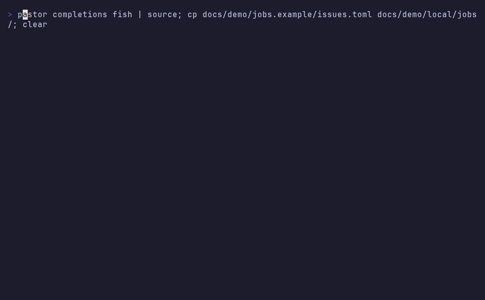

# pastor

**Run coding agents on machines you own, and let them work while your laptop is closed.**

[](https://github.com/cacarico/pastor/actions/workflows/ci.yml)
[](https://github.com/cacarico/pastor/releases)
[](https://crates.io/crates/pastor-cli)
[](LICENSE)

You give pastor work: a one-off task ("fix the flaky test"), or a job that
finds work on a schedule, such as new GitHub issues or cards on a board.
pastor picks a free machine, opens a terminal there, starts the agent
(Claude Code, opencode, ...), sends the prompt and keeps track of it. When you
come back, you read what it did, answer it if it asked something, or sit in
its terminal and carry on.

<p align="center">
  
</p>

## Who it's for

You run coding agents, you have one or more always-on machines (a home
server, a Raspberry Pi, a spare laptop), and you'd rather decide *what* to do
than babysit *where* and *how* it runs. pastor is the small layer that does
the babysitting: it queues the work, spreads it over your machines, notices
when an agent finished, got stuck or is waiting for you, and keeps a history.

It uses [herdr](https://herdr.dev) for the terminals, so every agent runs in a
real terminal you can attach to, on a machine you control. Nothing runs in
someone else's cloud. The longer story is in [the blog post](https://cacari.co/pastor/).

## How it works

```
   you ──► pastor CLI ──►  head: pastor serve  ──ssh + herdr──►  machine ──► agent in a
             ▲             queue · schedule ·                    (a Pi,       terminal, in a
             │             history · events                       a server)   git worktree
   jobs ─────┘                    │
   (a schedule + a connector:     └──► event hooks: comment on the issue,
    clock, GitHub issues, ...)          move the card, notify you
```

- **The head** is one machine that runs `pastor serve`. It holds the queue,
  the schedule and the history.
- **Machines** take the tasks. The head can be one of them. Others are
  reached over ssh, and each runs herdr.
- **A task** is one agent, one prompt, in a repo or in a fresh git worktree of
  it, so agents never step on each other.
- **A job** is a schedule plus a **connector** that finds work, and a prompt
  template that turns each piece of work into a task.
- **A flock** is a named group of machines, for example `work` and
  `personal`, so work and personal agents never mix accounts.

## Install

One line, no Rust toolchain and no sudo:

```sh
curl -fsSL https://raw.githubusercontent.com/cacarico/pastor/main/install.sh | sh
```

It downloads the release for your OS and CPU, checks it against the
release's checksums, and puts a single `pastor` binary in `~/.local/bin`.
Or with cargo (the crate is called `pastor-cli`; the command is `pastor`):

```sh
cargo binstall pastor-cli          # the prebuilt release
cargo install pastor-cli --locked  # build from source: Rust 1.88+ and a C compiler
```

You also need:

- [herdr](https://herdr.dev) 0.9 or newer on every machine, with its server running;
- ssh from the head to the other machines, without a passphrase prompt;
- the agents themselves (`claude`, `opencode`, ...), installed as usual on each machine.

## Quick start

Add the machines. The head can take tasks too:

```sh
pastor machine add here --local        # this machine
pastor machine add pi-1 user@pi-1      # a machine you can ssh to
pastor setup systemd                   # run the head as a user service (setup launchd on macOS)
```

Give it something to do, then check on it:

```sh
pastor task run "Fix the flaky test in ci.yml" --repo '~/work/api' --worktree
pastor task list                       # queued, running, blocked, done ...
pastor task read t-1                   # the agent's recent output
pastor task attach t-1                 # sit in its terminal; ctrl+b q detaches
pastor task send t-1 "yes, go ahead"   # answer it without attaching
```

If the agent stops to ask you something, the task shows as `blocked` with
its question, instead of pretending it finished.

## Jobs: work that finds itself

A job is one TOML file in `~/.config/pastor/jobs/`. This one wakes an agent
every weekday morning:

```toml
# ~/.config/pastor/jobs/morning.toml
cron = "0 9 * * 1-5"

[connector]
use = "clock"

[dispatch]
repo = "~/work/api"
prompt = "It is {{ item.key }}. Run the test suite and fix what broke."
```

<p align="center">
  
</p>

`pastor job list` shows every job and when it runs next. `pastor job describe
morning` shows one in full, `pastor job run morning` fires it now, and
`pastor job edit morning` opens it in your `$EDITOR` and only saves it once
it's valid.

## Connectors: where the work comes from

A connector is a small program that turns an outside source into work items.
`clock` is built in. Others install from GitHub:

```sh
pastor connector install cacarico/pastor-connectors/github-issues
pastor connector list
pastor connector describe github-issues   # who wrote it, where it came from, what it needs, which jobs use it
```

<p align="center">
  
</p>

This job starts an agent for every open issue labelled `pastor`, each in its
own worktree and branch, and comments on the issue when the agent is done:

```toml
# ~/.config/pastor/jobs/issues.toml
every = "10m"

[connector]
use = "github-issues"
repo = "acme/widgets"
label = "pastor"

[dispatch]
repo = "~/work/widgets"
worktree = true
branch = "pastor/issue-{{ item.key }}"
prompt = """
Fix issue #{{ item.key }}: {{ item.title }}

{{ item.body }}

Work test first, commit, and push the branch.
"""
```

Each piece of work has a stable key, so pastor never starts the same issue
twice. Connectors in [pastor-connectors](https://github.com/cacarico/pastor-connectors):

| Connector | Turns into tasks |
|---|---|
| `clock` (built in) | a schedule: every N minutes, or a cron line |
| [`github-issues`](https://github.com/cacarico/pastor-connectors/tree/main/github-issues) | open issues with a label; comments on the issue when its task ends |
| [`github-pr-reviews`](https://github.com/cacarico/pastor-connectors/tree/main/github-pr-reviews) | Copilot reviews with open findings, so an agent can fix them on the PR's branch |

A connector can also ship **event hooks** that run when a task is queued,
starts, finishes, fails or blocks: comment somewhere, move a card, send a
notification. Writing one takes a manifest and a script in any language. See
[Connectors in the manual](docs/manual.md#connectors).

## Everyday commands

| To... | Run |
|---|---|
| see the fleet | `pastor machine list`, `pastor machine describe pi-1` |
| start one task | `pastor task run "..." --repo DIR [--worktree] [--machine M]` |
| follow tasks | `pastor task list`, `pastor task describe t-3`, `pastor events --follow` |
| talk to an agent | `pastor task read t-3`, `pastor task send t-3 "..."`, `pastor task attach t-3` |
| end a task | `pastor task close t-3` (an agent can run `pastor task done` itself) |
| manage jobs | `pastor job list`, `job describe NAME`, `job run NAME`, `job edit NAME` |
| manage flocks | `pastor flock list`, `flock describe NAME`, `flock edit` |
| change settings | `pastor config edit` |
| use connectors | `pastor connector list`, `connector describe ID`, `connector install OWNER/REPO/DIR` |

Every list and describe takes `--json`. `make install` also installs fish
and bash completions that complete real names: `pastor job describe <TAB>`
lists your jobs, and `pastor task read <TAB>` lists your live tasks.

## Work and personal, on the right accounts

Put machines in flocks, and give a flock or a single machine its own agent:

```toml
# ~/.config/pastor/flock.toml
[[flock]]
name = "personal"
default = true

[[flock]]
name = "work"

[[machine]]
name = "laptop"
local = true
flock = "personal"
agent = "claude-personal"   # this machine's plain `claude` is a work login

[[machine]]
name = "pi-1"
ssh = "pi-1"
flock = "work"
```

```toml
# ~/.config/pastor/pastor.toml
[agents.claude-personal]
kind = "claude"
env = { CLAUDE_CONFIG_DIR = "~/.claude-personal" }
```

A task only ever runs on a machine in its own flock, with the agent that
machine names.

## Safety

- **Agents can't take over the fleet.** Every agent pastor starts is marked.
  From its terminal it can read (`task list`, `describe`), but it can't
  start or stop tasks, edit machines, jobs or settings, or start its own
  head, unless you allow it with `agents_change_fleet = true`.
- **Agents keep their permission prompts.** pastor passes the allow and deny
  lists you set for each flock. Turning the prompts off is your decision, and
  [the manual](docs/manual.md#trust-model) says when not to.
- **Nothing is closed that pastor didn't open.** pastor closes only the panes
  and workspaces it created, and keeps a worktree with unpushed commits or
  another agent in it.
- **Releases are signed.** Each release has checksums and a GitHub build
  attestation (`gh attestation verify ...`). Report vulnerabilities privately:
  see [SECURITY.md](SECURITY.md).

## Platforms

| Platform | Support |
|---|---|
| Linux x86_64, aarch64 | built, tested in CI and released |
| Linux armv7, riscv64 | built and released |
| macOS arm64, x86_64 | built and released; `pastor setup launchd` for the service |
| FreeBSD x86_64 | compiled on every pull request, no binaries |
| Windows | not supported; use WSL2 |

Linux binaries are static, so one download per CPU runs on any distro and on
every Raspberry Pi OS release.

## Learn more

- [The manual](docs/manual.md): every command, task state, file and setting.
- [Skill for agents](skills/pastor/SKILL.md): what a coding agent needs to know
  to use pastor, or to behave when pastor started it. `pastor --skill` prints it.
- [Spec skill](skills/spec/SKILL.md): `/pastor:spec` turns an idea into a plan
  your machines can run, one task after another, with nobody watching.
- [Changelog](CHANGELOG.md).

## Contributing

Issues and pull requests are welcome. `make check` runs formatting, clippy
and the whole test suite against a fake herdr, so you don't need a fleet to
work on pastor; `make help` lists the rest. Start with
[CONTRIBUTING.md](CONTRIBUTING.md) and [AGENTS.md](AGENTS.md). Rules for AI
contributors are in [docs/AI_GOVERNANCE.md](docs/AI_GOVERNANCE.md).

## License

[Apache License 2.0](LICENSE).
